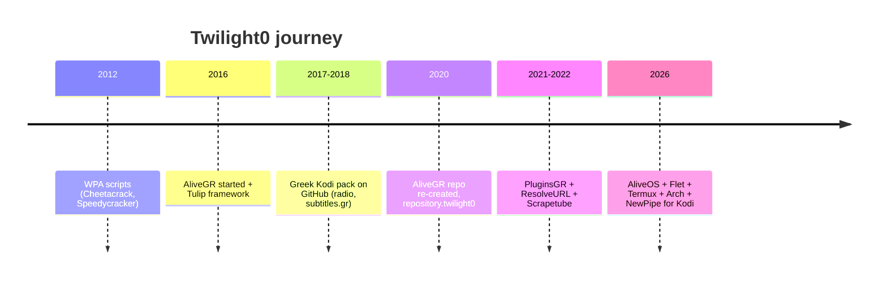
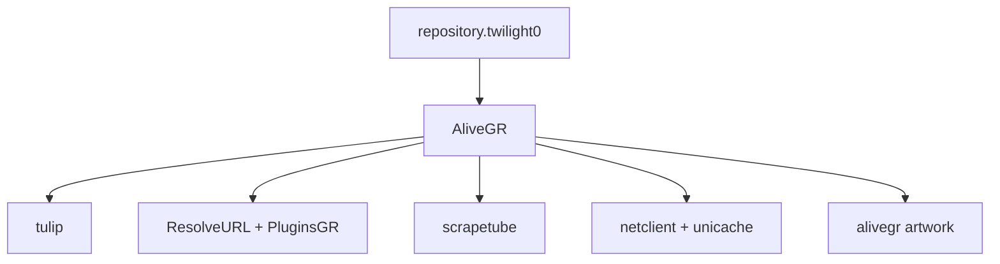
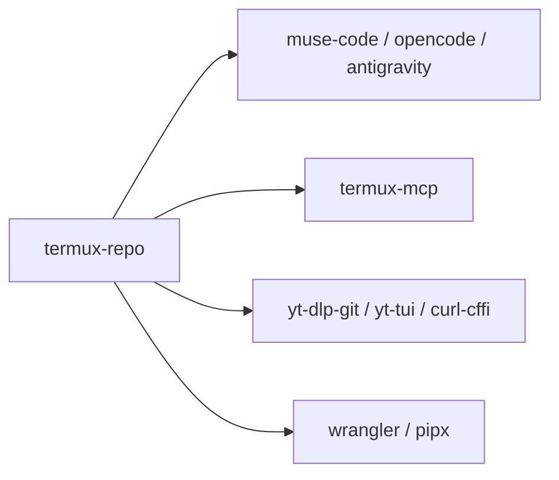

# 👋 Hello, I'm Twilight0!
### 🛠️ Creator of [AliveOS](https://github.com/Twilight0/aliveos) & [AliveGR](https://github.com/Twilight0/plugin.video.alivegr) 🌍

🌐 [aliveos.org](https://aliveos.org) · [alivegr.app](https://alivegr.app) · 💬 [AliveGR Discussions](https://github.com/Twilight0/plugin.video.alivegr/discussions)

---

### 🚀 About Me

Python developer from Greece, on GitHub since 2012. I build Greek streaming tools for Kodi, Linux desktop software, and cross-platform apps — zero-collection, no ads, local-first.

* 🐧 **Now:** [AliveOS](https://github.com/Twilight0/aliveos) — minimalist Arch-based distro + custom Cinnamon apps
* 📺 **Maintained:** [AliveGR](https://github.com/Twilight0/plugin.video.alivegr) v3.0 beta — started Jun 22 2016, on GitHub since Aug 29 2017
* 📲 **Mobile/CLI:** [termux-repo](https://github.com/Twilight0/termux-repo) — custom Termux APT with AI agents, yt-dlp, TLS tools
* 🧰 **Frameworks:** [Tulip](https://github.com/Twilight0/script.module.tulip), [PluginsGR](https://github.com/Twilight0/script.module.resolveurl.pluginsgr), [Scrapetube](https://github.com/Twilight0/script.module.scrapetube), [Netclient](https://github.com/Twilight0/script.module.netclient), ResolveURL fork
* 🌐 **Translator:** Kodi core, ResolveURL, YouTube addon

---

### 📺 Kodi — ~10 years (2016–present)

| | Project | Since | Description |
| :---: | :--- | :--- | :--- |
| ⭐ | [**AliveGR**](https://github.com/Twilight0/plugin.video.alivegr) | Jun 2016 · ~10y · 26★ | Everything Greek for Kodi, v3 beta |
| 📦 | [**repository.twilight0**](https://github.com/Twilight0/repository.twilight0) | 2017 · 9y · 22★ | Main addon repo + libs |
| 📖 | [**tulip**](https://github.com/Twilight0/script.module.tulip) | 2016 · 10y | Kodi Python framework, v4.1.4 |
| 🔌 | [**pluginsgr**](https://github.com/Twilight0/script.module.resolveurl.pluginsgr) | 2021 · 5y | Greek host resolvers |
| 📺 | [**scrapetube**](https://github.com/Twilight0/script.module.scrapetube) | 2022 · 4y | YouTube scraper, no API key |
| 🔒 | [**newpipe**](https://github.com/Twilight0/plugin.video.newpipe) | 2026 · 3★ | Privacy-first YouTube for Kodi |
| 💬 | [**subtitles.gr**](https://github.com/Twilight0/service.subtitles.subtitles.gr) | 2017 | Subtitles service + context menu |
| 📻 | eradio.gr / somafm | 2017-18 | Greek radio pack |

Recent Kodi work:
* `2026-10-09` AliveGR — alivegr.app links, Discussions as bug tracker
* `2026-10-08` Tulip 4.1.4 — transliterate, docs
* `2026-10-05` PluginsGR + Scrapetube sync
* `2026-10-01` ResolveURL — HttpResponse close/context manager

---

### 🐧 AliveOS — 2026–present

[Facebook](https://www.facebook.com/AliveOS.Linux/) · [aliveos.org](https://aliveos.org)

| | Project | Description |
| :---: | :--- | :--- |
| 🐧 | [**aliveos**](https://github.com/Twilight0/aliveos) | Main distro (Arch/Garuda + Cinnamon) |
| 🌐 | [**aliveos.org**](https://github.com/Twilight0/aliveos.github.io) | Landing page, v0.1 target Q1 2027 |
| 📦 | [**aliveos-repo**](https://github.com/Twilight0/aliveos-repo) | Package repo |
| ⚙️ | [**aliveos-settings**](https://github.com/Twilight0/aliveos-settings) | Schemas, applets, extensions |
| 🎨 | [**aliveos-assets**](https://github.com/Twilight0/aliveos-assets) | Icons, wallpapers, logo |
| 🎬 | [**respite**](https://github.com/Twilight0/respite) | Parole fork player, C |
| 📝 | [**Skript**](https://github.com/Twilight0/Skript) | GTK3 markdown editor/viewer, C |
| 🔢 | [**valuate**](https://github.com/Twilight0/valuate) | Calculator, Vala |
| 🔌 | [**xdg-desktop-portal-aliveos**](https://github.com/Twilight0/xdg-desktop-portal-aliveos) | File picker portal, C |

---

### 📲 Termux — 2026–present

[**termux-repo**](https://github.com/Twilight0/termux-repo) — custom APT repository for packages missing from official Termux repos. Weekly CI, GitHub Pages deploy:

`curl -sL https://twilight0.github.io/termux-repo/install.sh | bash`

| Package | What it is |
| :--- | :--- |
| `muse-code` | Meta Muse Code agent (proot, ARM64/x86_64) |
| `opencode` / `opencode-legacy` | AI coding assistant v2 (glibc, no proot) / v1 (proot) |
| `termux-mcp` | Termux REST API daemon + MCP server for AI agents |
| `antigravity-cli` / `oh-my-pi` / `agentty` / `9router` | AI CLIs + router |
| `yt-dlp-git` / `yt-tui` / `curl-cffi` | Video downloading + browser TLS impersonation |
| `wrangler` / `pipx` | Cloudflare Workers CLI + Python isolated apps |

Also: [**muse-code**](https://github.com/Twilight0/muse-code) AUR + Termux packaging, `nouveau-fermi-reclock-dkms`, `curl-cffi-builder`.

---

### 📱 Flet / Python apps — 2026

* [**flet-practical**](https://github.com/Twilight0/flet-practical) — Clipboard, Notifications, WakeLock, EdgeTTS, Share
* `org.flettts.demo` — Edge Neural TTS demo · `org.weeknum` · `org.walkertracker`

---

### 🧪 Tech Stack

)

---

### 💖 Support

| Platform | Link |
| :--- | :--- |
| Ko-fi | [ko-fi.com/alivegr_twilight0](https://ko-fi.com/alivegr_twilight0) / [ko-fi.com/twilight0](https://ko-fi.com/D1D11UQ0IO) |
| Patreon | [patreon.com/twilight0](https://www.patreon.com/twilight0) |
| PayPal | [paypal.me/AliveGR](https://paypal.me/AliveGR) |

